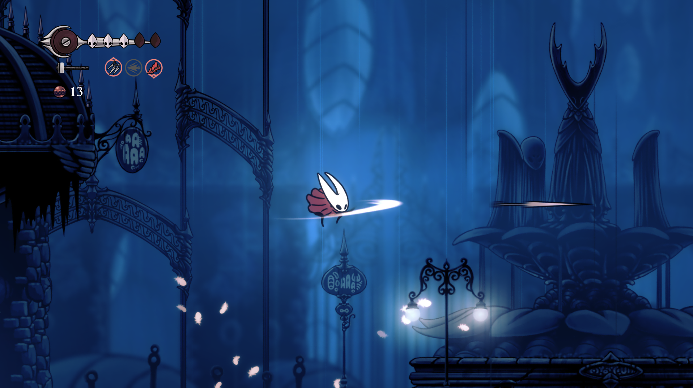

# Hornet in Hallownest

A Hollow Knight Mod, bringing Hornet as a playable character to the base game.



By Jakob Hellermann (`@dubi steinkek`) and Planet_Xplorer

## Status

Playable with some bugs, currently ready for playtesting.

Right now the mod is only playable on the latest Hollow Knight version (1.5.12620, released 2026) with this branch of the modding API: https://github.com/hk-modding/api/pull/164.
The download can be found in the releases tab: [https://github.com/jakobhellermann/hkmod-HornetInHallownest/releases/tag/v0.1.0]

Please check the existing [issues](https://github.com/jakobhellermann/hkmod-HornetInHallownest/issues) when reporting a bug.

> [!IMPORTANT]
> After installing the mod, you have to start the game *twice*.
> The first run will say `HornetInHallownest: Failed to initialize! Check ModLog.txt` in the mod menu.

The changelog can be found in [CHANGELOG.md](./CHANGELOG.md).

## Ability Sync

Most abilities from Hollow Knight are automatically granted, e.g. `Vengeful Spirit` -> `Silkspear`, `Dreamnail` -> `Needolin`.
The full list of mapping can be in [this google sheet](https://docs.google.com/spreadsheets/d/1V3tq-4Mp1XaV8E_Dwz7N1Tk0cHRW7SyeBtjGcvBrrHg).

Currently, all crests and tools are automatically granted.

## Requirements

In order to avoid redistributing assets from Silksong, the mod requires an installation of Silksong next to the Hollow Knight installation. Alternatively you can specify the path in the configuration, see below.

**TODO**: currently some assemblies are redistributed still, they should be reused from silksong as well.

| Hollow Knight  | Silksong version    |
| -------------- | ------------------- |
| 1.5.12620      | 1.0.30000           |

**Older versions of Hollow Knight:** Currently unsupported

**Older versions of Silksong:** Currently untested, but I'd like to support all of them

### macOS on Apple Silicon

HornetInHallownest requires Hollow Knight to run under Rosetta on Apple Silicon Macs.
If running through Steam, set the game's launch options to:
```sh
/bin/sh -c 'exec /usr/bin/arch -x86_64 "$0/Contents/MacOS/Hollow Knight" "$@"' %command%
```
If you are running it manually, enable `Open using Rosetta` in Finder (right-click Hollow Knight.app -> Get Info).

## Config

The config file can be found as `HornetInHallownest.GlobalSettings.json` in

- **Windows:** `%USERPROFILE%/AppData/LocalLow/Team Cherry/Hollow Knight`
- **macOS:** `~/Library/Application Support/unity.Team Cherry.Hollow Knight`
- **Linux:** `~/.config/unity3d/Team Cherry/Hollow Knight`

**Default config:**

```json
{
  "SilksongPath": null,
  "Controls": {
    "MoveLeft": null,
    "MoveRight": null,
    "MoveUp": null,
    "MoveDown": null,
    "Jump": null,
    "Attack": null,
    "Dash": null,
    "Harpoon": null,
    "Bind": null,
    "Tool": null,
    "Needolin": null,
    "OpenInventory": null,
    // without HK equivalents
    "Taunt": "V",
    "OpenTools": "L",
    "SwitchHero": "F5"
  },
  "BothActive": false # experimental
}
```

Keybindings can be set to letters (`A`–`Z`), digits (`Key0`–`Key9`), function keys (`F1`–`F15`)
and mouse buttons (`LeftButton`, `RightButton`, `Button5`, …), or `null`.

For the bindings with HK equivalents, `null` means reusing the existing keybinding.

The full list of available keybinds can be found in the [InControl `Key` and `Mouse` enums](https://www.gallantgames.com/incontrol-api/html/namespace_in_control.html).

## Uninstall

Right now, Hornet in Hallownest has to copy some files into the HK `Managed/` dir.
After removing the mod from the `Managed/Mods` folder these don't do anything, but to fully uninstall you have to do these steps manually:

1. Replace `ScriptingAssemblies.json` with `ScriptingAssemblies.json.hornetbak` (in `hollow_knight_Data`)
2. Remove all assemblies prefixed with `Silksong.` from `Managed/`
3. Remove the following additional assemblies from `Managed/`: `Unity.Addressables.dll`, `Unity.ResourceManager.dll`, `Unity.Profiling.Core.dll`, `Unity.Mathematics.dll`, `Unity.Burst.dll`, `Newtonsoft.Json.UnityConverters.dll`, `TeamCherry.Splines.dll`, `Coffee.SoftMaskForUGUI.dll`.


## Development

[Source/HornetInHallownest.csproj](Source/HornetInHallownest.csproj) attempts to configure the
`GamePath`, `HollowKnightRefs` and `SilksongGamePath` variables automatically.
If they don't work for your setup, change them in the `.csproj`, or in a `LocalConfig.props`.

Before building, you'll have to run
```sh
dotnet msbuild -t SetupSilksongLibs
```
once in order to generate the `Source/lib/Silksong.*.dll` libs from the silksong install.

On build, the mod will automatically be copied to the game's `Mods/HornetInHallownest` directory:
```sh
dotnet build
```
triggering hot reload if enabled in the modding API (if using [hk-modding/api#160](https://github.com/hk-modding/api/pull/160)).

To create a zip for distribution, run
```sh
dotnet publish
# Source/bin/Release/HornetInHallownest.zip
```
